# Hi, I'm Arham 👋

> Full Stack Developer.  
> Not just another coder—I’m all about the creative side of tech, a fan of minimalism and brutalism, building systems, UIs, and websites that just stand out.

## TechStack

```mermaid
%%{ init: { "look": "handDrawn", "themeVariables": { "fontFamily": "Comic Sans MS" } } }%%
graph TD
    A[TechStack]

    %% Languages
    A --> B[Languages]
    B --> B1[JavaScript / TypeScript]
    B --> B2[PHP]
    B --> B3[C#]

    %% Frontend (Under JavaScript/TypeScript)
    B1 --> C[Frontend]
    C --> C1[Next.js]
    C --> C2[React]
    C --> C3[Angular]
    C --> C4[Vue.js]
    C --> C5[Tailwind CSS]
    classDef frontendFramework fill:#61DAFB,stroke:#333,stroke-width:2px,color:#000;
    class C1,C2,C3,C4,C5 frontendFramework;

    %% Backend (Under JavaScript/TypeScript)
    B1 --> D[Backend]
    D --> D1[Node.js]
    D --> D2[Fastify]
    D --> D3[Nest.js]
    D --> D4[Express.js]
    classDef backendFramework fill:#339933,stroke:#333,stroke-width:2px,color:#FFF;
    class D1,D2,D3,D4 backendFramework;

    %% Mobile (Under JavaScript/TypeScript)
    B1 --> E[Mobile]
    E --> E1[Ionic]
    E --> E2[React Native]
    classDef mobileFramework fill:#FF7F50,stroke:#333,stroke-width:2px,color:#FFF;
    class E1,E2 mobileFramework;

    %% .NET under C#
    B3 --> F[.NET]
    classDef dotnetFramework fill:#512BD4,stroke:#333,stroke-width:2px,color:#FFF;
    class F dotnetFramework;

    %% Cloud Platforms
    A --> G[Cloud Platforms]
    G --> G1[GCP]
    G --> G2[Azure]
    G --> G3[AWS]
    classDef cloudFramework fill:#232F3E,stroke:#333,stroke-width:2px,color:#FFF;
    class G1,G2,G3 cloudFramework;

    %% Databases
    A --> H[Databases]
    H --> H1[MongoDB]
    H --> H2[MySQL]
    H --> H3[PostgreSQL]
    classDef databaseFramework fill:#FF5733,stroke:#333,stroke-width:2px,color:#FFF;
    class H1,H2,H3 databaseFramework;

    %% Tools
    A --> I[Tools]
    I --> I1[Git]
    I --> I2[Shell]
    classDef toolsFramework fill:#6495ED,stroke:#333,stroke-width:2px,color:#FFF;
    class I1,I2 toolsFramework;

    %% Title Styling
    classDef title fill:#FFD700,stroke:#000,stroke-width:2px,color:#000,font-size:16px,font-weight:bold;
    class A title;
```

Languages Breakdown:
-------------------
🚀 JavaScript   : <!-- JS_LINES_PLACEHOLDER --> 88957 lines  
🌀 TypeScript   : <!-- TS_LINES_PLACEHOLDER --> 77745 lines  
📦 JSX          : <!-- JSX_LINES_PLACEHOLDER --> 20247 lines  
🌱 Vue.js       : <!-- VUE_LINES_PLACEHOLDER --> 13154 lines  
🐘 PHP          : <!-- PHP_LINES_PLACEHOLDER --> 5248 lines  
💻 C#           : <!-- CSHARP_LINES_PLACEHOLDER --> 15066 lines  
🔍 Other        : <!-- OTHER_LINES_PLACEHOLDER --> 36884 lines  

🎯 **Total Lines of Code: <!-- TOTAL_LINES_PLACEHOLDER --> 223900 lines  

### Open Source Projects

- **[Next Shadcn Admin Dashboard](https://github.com/arhamkhnz/next-shadcn-admin-dashboard)**  
Admin Dashboard built with Next.js 14 + TypeScript + Shadcn UI  

### Find Me On !

